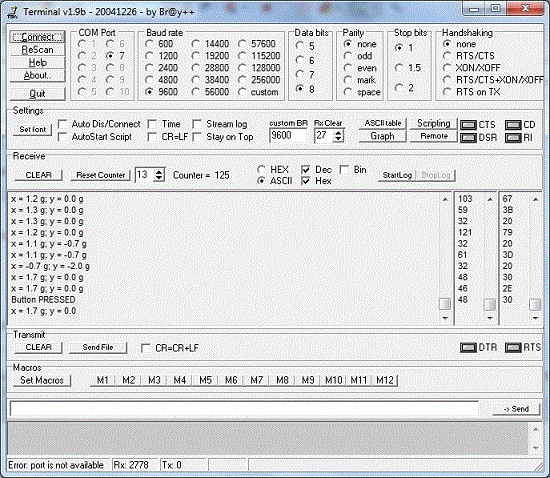

**Description**

*Home tasks are:*

• Create project which contains Inter-task communication and synchronisation
(RTOS Task Notifications, Stream and Message Buffers, Queues, Binary Semaphores,
Counting Semaphores, Mutexes). 

**Requirements**

Keil uVision v5.35.0.0 
STM32CubeMX v6.3.0 

**Task notes**

In the program a few tasks are created. Two tasks are used to read the acceleration values 
from LSM303DLHC sensor, which is on the STM32F303 Discovery board, along the X and Y axes respectively.
The LSM303DLHC is connected to the microcontroller via I2C bus. A mutex is used to synchronize 
these tasks and prevent them from reading data from the sensor simultaniously.
These raw values (in hardware units) are put into the queues. For acceleration values along X and Y axes
two separate queues are used. Another task, which has a role of a gatekeeper, reads acceleration values 
from both queues, converts them to the physical values of acceleration in fractions of gravitational
acceleration (g) and formats a string (array of char), which is put into a stream buffer and passed to 
another task. This task is also converts the raw acceleration values into X and Y indexes that are used to index
2D array (matrix). The 2D array contains pin numbers the LEDs connected to. This indexes are packed
into a struct instance and passed to the LEDs controller task by means of the other queue. The LEDs controller
task uses received indexes to determine which LED should be switched on. Changes in the slope of the
Discovery board will cause changes in the position of a switched on LED. So, moving (circular motion) 
the Discovery board creates nice visual effects on the LEDs. There is a task that reads the available data from 
the stream buffer and transmits them via USART2. The USB to RS-232 converter is needed to check this functionality
(PA2 is USART2_TX, PA3 is USART2_RX). There are also two tasks that are used to test the LEDs. 
One of these tasks reads the user button state and notifies the other task wheter the button pressed or released.
The event group is used for notifications. If the button is pressed, the tasks that reads data from the sensor, 
process these data and controls the LEDs are suspended, and all the LEDs are switched on. It allows to check
if all the LEDs work. Releasing the user button resumes suspended threads execution. When the button is pressed,
the text message is transmitted via USART2. To synchronize the tasks that use USART2 to transmit text messages
a semaphore is used. 

**Task demonstration**
 

 

